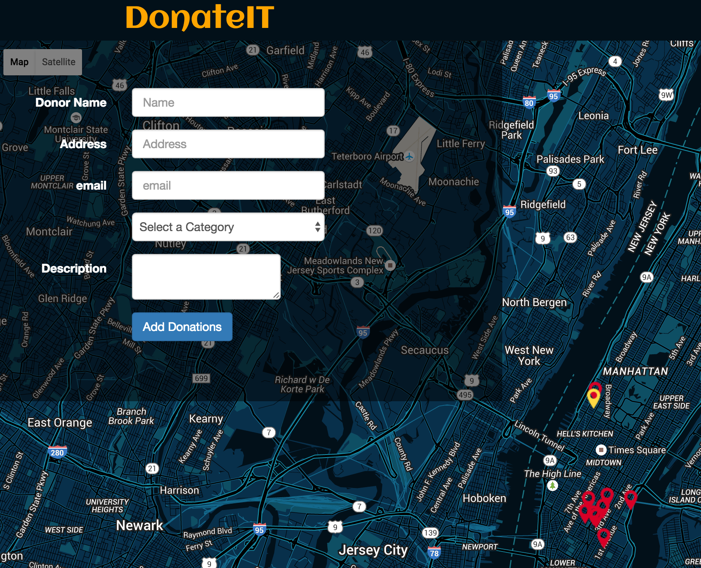

# DonateIT
Hack it together one day project.

# Mission Statement
 DonateIT is a platform that allows users to set up their donations at a pick up location for charities to pick up. It allows people to make donations easily without getting into the hassle of actually going to the charity. Perfect for lazy people who still want to contribute to the society

# Technologies Used
 * HTML/CSS
 * JavaScript
 * Node.js
 * Express.js
 * Postgres/SQL
 * Google Maps and Places API
 * node modules -pg,body-parser,dotenv,morgan,,pg-promise,path

# User Stories
-  As a user, I should be able to see a welcome page
-  As a user, I should be able to add a pick up location for my donations
-  As a user, I should be able to see a form that I can enter name, email, address, items to be donated
-  As a user, I should be able to see a new marker on the map  after I add my donation description
-  As a user, I should be able to see the pick locations and people who are ready to donate
- BONUS - set up user registration where you can register as a donor or as charity

# App Preview
#
#

# Future Implementations
- Setup user authentication
- Set up user roles so users can log in as a charity or a donor
- Set up an appointment page for charity to contact donors
- Give donors to add multiple items at a time

# Team Members:
* Emma Hou
* Lauren Golik
* Emine Koc
* Razaik Boparai
